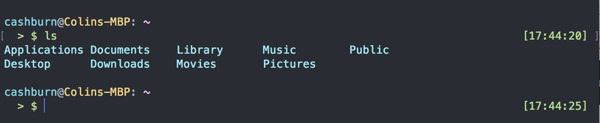
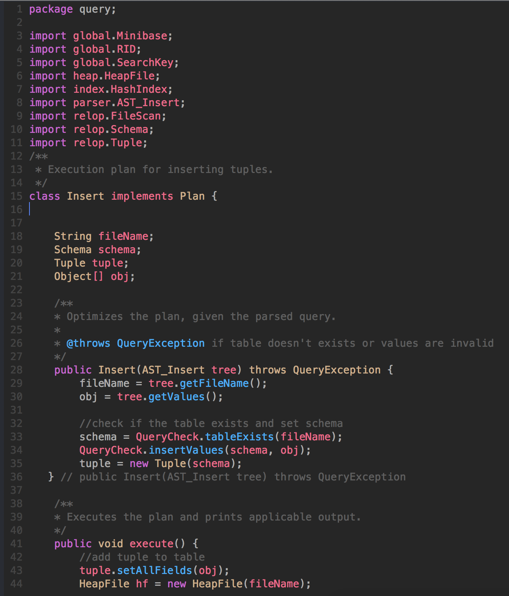

## Colin's Dot Files

This package includes some customization for Bash, heavy customization for Zsh (preferred), and Vim.

Zsh:
- [oh-my-zsh](https://github.com/robbyrussell/oh-my-zsh)
- [zsh-syntax-highlighting](https://github.com/zsh-users/zsh-syntax-highlighting)
- [zsh-history-substring-search](https://github.com/zsh-users/zsh-history-substring-search)
- Color-coded bash/zsh theme

Vim (with customized JS, Java, and C++ syntax highlighting)
- [vim-pathogen](https://github.com/tpope/vim-pathogen)
- [supertab](https://github.com/ervandew/supertab)
- [vim-javascript](https://github.com/pangloss/vim-javascript) with customizations
- [Java Vim Syntax](http://www.fleiner.com/vim/syntax/java.vim) with customizations
- [C++ Vim Syntax](http://www.haeggblad.com)
- [onedark.vim](https://github.com/joshdick/onedark.vim) with customizations, made to look like Atom

### Usage

1. IMPORTANT! Modify the `zshrc` file to set your username and email
1. To set up all zsh customization and switch the default shell to zsh, run `./dot.sh`.
1. To set up the Vim customization, run `./vim.sh`.

